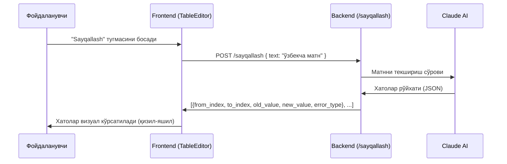

# Режа: "Sayqallash" — Ўзбек тили учун GEC (Grammatical Error Correction)

Tahrirgoh тизимидан илҳомланган, ўзбек тилидаги матнларда грамматик, имловий ва услубий хатоликларни автоматик аниқлаш ва кўрсатиш функцияси.

## Тизим қандай ишлайди



## Босқичма-босқич режа

### Босқич 1: Backend — `/sayqallash` эндпойнт

#### [NEW] `/sayqallash` endpoint in [main.py](file:///c:/Users/Администратор/Desktop/2/backend/main.py)

AI га ўзбекча матнни юбориб, хатоликлар рўйхатини олиш:

```python
POST /sayqallash
Body: { "text": "Ўзбекча матн..." }
Response: {
  "annotations": [
    {
      "from_index": 15,
      "to_index": 22,
      "old_value": "хатоси",
      "new_value": "хатоси",
      "error_type": "S/Spelling"
    }
  ],
  "corrected_text": "Тўлиқ тузатилган матн"
}
```

**AI Prompt стратегияси**: Claude га ўзбек тили грамматикаси, имлоси ва фармацевтик терминология бўйича эксперт сифатида ишлаш топшириқаси берилади.

**Хато турлари** (Tahrirgoh стандарти):

| Код | Тавсиф |
|-----|--------|
| `S/Spelling` | Имловий хато |
| `S/Context` | Контекстга номос сўз |
| `S/LowerUpper` | Катта/кичик ҳарф |
| `Punctuation` | Тиниш белгилари |
| `G/Case` | Келишик қўшимчалари |
| `G/Possessive` | Эгалик қўшимчалари |
| `G/Merge` | Бирга ёзиш |
| `G/Split` | Ажратиб ёзиш |
| `G/VerbTense` | Замон шакли |
| `G/Other` | Бошқа грамматик хато |
| `F/Clarity` | Аниқлик (маъно) |
| `F/Style` | Услубий хато |
| `F/Calque` | Калька (тўғридан-тўғри таржима) |

---

### Босқич 2: Frontend — "Sayqallash" тугмаси ва визуал кўрсатиш

#### [MODIFY] [TableEditor.tsx](file:///c:/Users/Администратор/Desktop/2/frontend/components/TableEditor.tsx)

1. **LangCell компонентига ўзгаришлар** (фақат `lang === 'uz'` учун):
   - "AI Yaxshilash" остига **"Sayqallash"** тугмаси қўшилади (кўк-яшил градиент)
   - Тугма босилганда → `/sayqallash` га `uz_proposed || uz_v1` юборилади
   - Натижа `annotations` массиви қайтади

2. **Хатолар визуализацияси** (Tahrirgoh услубида):
   - Proposed/Confirmed textarea ўрнига **AnnotatedText** компоненти кўрсатилади
   - Хатосиз сўзлар — оддий матн
   - Хатоли сўзлар — ~~қизил чизиқ~~ + **яшил тузатиш**
   - Ҳар бир хатонинг тури (S/Spelling, G/Case ва ҳ.к.) tooltip да кўрсатилади
   - Хатони қабул қилиш (✓) ёки рад этиш (✕) тугмалари

3. **"Ҳаммасини қабул қилиш"** тугмаси — барча тузатишларни бир марта босиш билан Proposed матнга жорий қилади

---

### Босқич 3: Блок алмашуви хатолигини тузатиш

> [!IMPORTANT]
> Блок алмашуви хатолиги аллақачон тузатилган (React state mutation issue). Row объектларини clone қилиш қўшилди. Саҳифани янгилаб текширинг.

## Фойдаланиш сценарийси

1. Файл юкланади → таржимон ўзбек тилидаги матнни V1 дан Proposed га олади
2. **"Sayqallash"** босилади → AI матнни текширади
3. Хатолар қизил-яшил формат да кўрсатилади, масалан:
   > ~~фармацевтк~~ → **фармацевтик** `[S/Spelling]`
   > ~~Суюқлик юза~~ → **Суюқлик юзасида** `[G/Case]`
4. Фойдаланувчи ✓ билан қабул қилади ёки ✕ билан рад этади
5. Қабул қилинган тузатишлар Proposed матнга автоматик киритилади

## Верификация

1. Ўзбекча фармацевтик матн киритилади
2. "Sayqallash" босилади
3. Хатолар аниқланиб, қизил-яшил формат да кўрсатилади
4. "Ҳаммасини қабул қилиш" босилади → Proposed матн тузатилади
